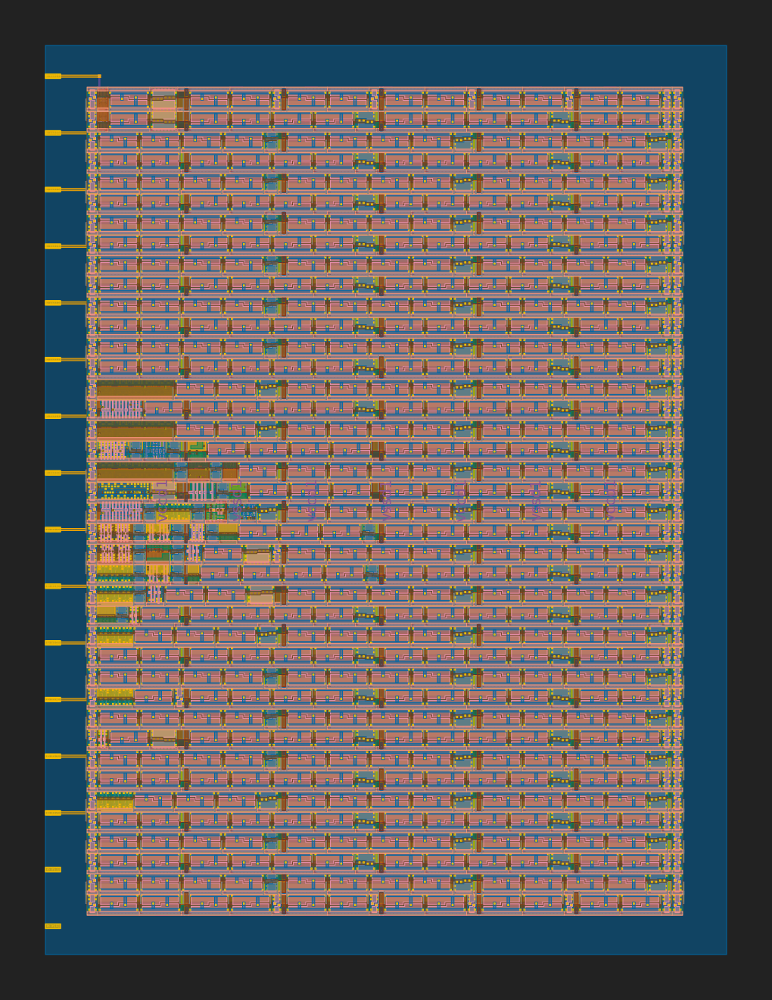

 

# TinyTapeout Multiply-Accumulate

The goal of this project is to create a Multiply-Accumulate unit to be submitted for [TinyTapeout](https://tinytapeout.com/)

I am documenting this iteratively and will list all of the versions that could potentially be produced.

## Version 1
The first version is focussed on getting the GitHub workflow working with VHDL. To make it not too complicated I will just use the Yosys GHDL plugin to convert the VHDL to Verilog (as shown here: https://github.com/britovski/adder). One action is added to the workflow before the configure.py script that runs the conversion to Verilog.

### Logic
Just to test the synthesis flow I implemented simple multiplication as a naive multiplication primitive: ```p <= a * b```

### GDS


### Cell stats

| cell type | number |
|-----------|--------|
| ef_sc_hd__decap_12 | 446 |
| fd_sc_hd__a211o_1 | 1 |
| fd_sc_hd__a21oi_4 | 2 |
| fd_sc_hd__a22o_1 | 2 |
| fd_sc_hd__a22oi_2 | 2 |
| fd_sc_hd__and2_1 | 2 |
| fd_sc_hd__and2_2 | 1 |
| fd_sc_hd__and3_1 | 1 |
| fd_sc_hd__and4_1 | 1 |
| fd_sc_hd__buf_2 | 1 |
| fd_sc_hd__clkbuf_1 | 2 |
| fd_sc_hd__conb_1 | 2 |
| fd_sc_hd__decap_3 | 111 |
| fd_sc_hd__decap_4 | 30 |
| fd_sc_hd__decap_6 | 77 |
| fd_sc_hd__decap_8 | 6 |
| fd_sc_hd__dlymetal6s2s_1 | 6 |
| fd_sc_hd__fill_1 | 103 |
| fd_sc_hd__fill_2 | 7 |
| fd_sc_hd__nand2_1 | 1 |
| fd_sc_hd__nand2_2 | 1 |
| fd_sc_hd__nand4_1 | 1 |
| fd_sc_hd__nor2_2 | 1 |
| fd_sc_hd__nor2_4 | 1 |
| fd_sc_hd__nor3b_4 | 1 |
| fd_sc_hd__o211a_1 | 1 |
| fd_sc_hd__or2_1 | 1 |
| fd_sc_hd__or2_2 | 1 |
| fd_sc_hd__or2b_1 | 1 |
| fd_sc_hd__tapvpwrvgnd_1 | 105 |
| fd_sc_hd__xnor2_4 | 3 |
| total | 921 |

### Routing stats

| Utilisation | Wire length (um) |
|-------------|------------------|
| 3.22 | 922 |

## Info
* [Enabling GitHub Pages](https://tinytapeout.com/faq/#my-github-action-is-failing-on-the-pages-part)

## Resources

* [FAQ](https://tinytapeout.com/faq/)
* [Digital design lessons](https://tinytapeout.com/digital_design/)
* [Join the community](https://discord.gg/rPK2nSjxy8)

## What next?

* Share your GDS on Twitter, tag it [#tinytapeout](https://twitter.com/hashtag/tinytapeout?src=hashtag_click) and [link me](https://twitter.com/matthewvenn)!
